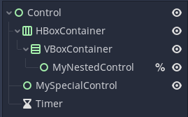

# GodotSharpExtras
C# Extras for Godot, provides tools that are not currently implemented by the Core GodotSharp library.  One being the _onready_ keyword.  Instead, this is replaced with using two C# attributes, called NodePath() and ResolveNode() attributes, that allows easily to reference a variable to their proper node in the Scene / SceneTree.

# Installation
To install this library, simply use dotnet command line tool, to add a package reference for GodotSharpExtras, using the following command:

```
dotnet add package GodotSharpExtras
```

# Compilation
In order to compile a custom version of this project, you will need the GodotSharp libraries from an existing Project which can be found under ```.mono``` folder.  In order to make it easier to build, simply copy the .mono folder from one of your projects, directly into the root of this folder, and then run the following command:

```
dotnet build
```

This will compile the DLL file, as well as create a Nuget package, that you can install locally, or you can simply copy the DLL file over to your project, under any folder you want, and add the following to your project's csproj file.

```xml
<ItemGroup>
    <Reference Include="GodotSharpExtras">
        <HintPath>Path\To\GodotSharpExtras.dll</HintPath>
    </Reference>
</ItemGroup>
```

## OnReady()
This function is what wires everything up from the Godot side of things, to the C# Side of things. In order for C# to be able to get the nodes it needs to reference with the proper C# Variables, OnReady() needs to be called.  By the Godot documentation, it isn't recommended to use `this` when calling various functions on the node, but due to the nature in which the system needs to wire things up, it needs a reference to the node that we are running the OnReady() function on to be able to ensure that the variables are properly setup with the values.  This is done through the C#'s Extension Methods.  This allows us to add OnReady() to a node reference, without having to recompile GodotSharp in order to add this method.  See examples for NodePath and ResolveNode on how OnReady() works.

## NodePath
NodePath will use a String Path to the Node that you want to access from the Godot side of things, in C#.  It takes care of actually getting the instance when you call the OnReady() function in C#.

Example:
```cs
using Godot;
using Godot.Sharp.Extras;

public class MyNode : Container {
    [NodePath("Container/Label")]
    Label MyLabel;
    
    public override void _Ready() {
      this.OnReady();
      
      MyLabel.Text = "Hello World!";
    }
}
```

With the release of Godot 3.5 (available in RC releases, and soon Stable Releases), NodePath can now more efficently find nodes in the Scene Tree.  Two additonal options can
be used with NodePath, the first being that when No path is specified, it will attempt to find the node by using the Variable name, the Variable name with the '%' unqiue name
and finally by the Type name.  For example:

### Scene Tree:


### Code:
```cs
using Godot;
using Godot.Sharp.Extras;

public class MyNode : Control {
    [NodePath] Control MySpecialControl = null;
    [NodePath] Control MyNestedControl = null;
    [NodePath] Timer Countdown = null;

    public override void _Ready() {
      this.OnReady();
    }
}
```

## ResolveNode
ResolveNode allows an exported variable to the editor, to receive a NodePath, that can still be resolved to an actual node used within the C# code, as a reference to the node in the same way that NodePath is used.  The difference is, the NodePath is an Assignment from the Editor, or code, instead of it being a string path to the node itself.

Example:
```cs
using Godot;
using Godot.Sharp.Extras;

public class MyNode : Node2D {
  [Export]
  public string SpritePath;
  
  [ResolveNode(nameof(SpritePath))]
  Sprite PlayerSprite;
  
  public override void _Ready() {
    this.OnReady();
    
    PlayerSprite.Location = new Vector2(120,120);
  }
}
```

## Resource
Resource attribute, added in 0.3.4 allows you to do the same thing as preload(), allowing you to load up your resources into variables, making it easer to reference
what are resources, and what are nodes.

Example:
```cs
using Godot;
using Godot.Sharp.Extras;

public class MyNode : Node2D {
  [NodePath] Sprite MySprite = null;
  [Resource("res://Assets/Player/Sprite.png")] StreamTexture SpriteTexture = null;
  [Resource("res://Scenes/Bullets/Fireball.tscn")] PackedScene Fireball = null;

  public override void _Ready() {
    this.OnReady();
    MySprite.Texture = SpriteTexture;
  }

  public override void _Input(InputEvent event) {
    if (event.IsActionJustPressed("fire")) {
      var fireball = Fireball.Instance<Fireball>();
      fireball.Position = MySprite.Position;
      fireball.Fire();
    }
  }
}
```

## Singleton
Singletons, or AutoLoads as they are referenced in Godot, are now easily accessable in C# through two different ways.  The first is with the Singleton Attribute,
allowing you to declare a singleton at the top of your script, for easy access.  The other, is with the static generic method Singleton.Get<T>();

Example 1: Singleton Attribute
```cs
using Godot;
using Godot.Sharp.Extras;

public class MyNode : Node2D {
  [Singleton] SceneManager SceneManager;

  public override void _Ready() {
    this.OnReady();

    GD.Print(SceneManager.GetCurrentSceneName());
  }
}

Example 2: C# Method of Singleton Pattern
```cs
using Godot;
using Godot.Sharp.Extras;

public class SceneManager : Node {
  private static SceneManager _instance = null;
  public static SceneManager Instance {
    get {
      if (_instance == null)
        _instance = Singleton.Get<SceneManager>();
      return _instance;
    }
  }

  public string GetCurrentSceneName() {
    return "Current Scene";
  }
}
```

## SignalHandler
SignalHandler allows you to connect node signals to methods to automatically be connected when OnReady is executed.  You provide the Signal you wish to connect, along with the property or field of the variable holding the Node reference, to connect said signal.  If the property or field does not exist, will throw an exception.

Example 1 (Standard Connect to node defined by NodePath/ResolvePath):
```cs
using Godot;
using Godot.Sharp.Extras;

public class MyNode : Node2D {
  [NodePath("VBoxContainer/MyButton")]
  Button _myButton = null;

  public override void _Ready() {
    this.OnReady();
  }

  [SignalHandler("pressed", nameof(_myButton))]
  void OnPressed_MyButton() {
    GD.Print("Hello World!");
  }
}
```

Example 2 (Connect to the node itself):
```cs
using Godot;
using Godot.Sharp.Extras;

public class MyControl : Control
{
  [NodePath("ColorRect")]
  ColorRect _color = null;
    
  public override void _Ready()
  {
    this.OnReady();
  }
    
  [SignalHandler("mouse_entered")]
  void OnMouseEntered() {
    _color.Color = new Color(0,1,0);
  }
    
  [SignalHandler("mouse_exited")]
  void OnMouseExited() {
    _color.Color = new Color(0,0,1);
  }
}
```

Example 3 (Chaining Multiple Nodes to the Same Function):
```cs
using Godot;
using Godot.Sharp.Extras;

public class MyPanel : Panel
{
  [NodePath("Button1")]
  Button _button1 = null;

  [NodePath("Button2")]
  Button _button2 = null;

  public override void _Ready()
  {
    this.OnReady();
  }

  [SignalHandler("pressed", nameof(_button1))]
  [SignalHandler("pressed", nameof(_button2))]
  void OnButtonPressed() {
    GD.Print("A button has been pressed.");
  }
}
```

## Fluent Signals
Added in 3.1, Fluent Signals now allow for easy chaining of signal connect methods, in the form of a sentance.  An example of this in action:

```cs
using Godot;
using Godot.Sharp.Extras;
using Godot.Sharp.Extras.Fluent;

public class MyPanel : Panel
{
  [NodePath] Button MyTestButton = null;
  ConnectedBinding ButtonSignalHandler = null;
  
  public override void _Ready() {
    this.OnReady();

    ButtonSignalHandler = MyTestButton.Connect("pressed")
          .WithBinds("Optional Params", MyTestButton, this)
          .WithFlags(ConnectFlags.Deferred,ConnectFlags.ReferenceCounted)
          .To(this,"OnButtonPressed");
  }

  public OnButtonPressed(string Param, Button theButton, Control parent) {
    // process stuff
    ButtonSignalHandler.Disconnect();
  }
}
```

## Math Functions
int.InRange(min,max)
float.InRange(min,max)
double.InRange(min,max)
Vector2.InRange(min,max)
Vector2I.InRange(min,max)
Vector3.InRange(min,max)
Vector3I.InRange(min,max)

These functions allow you to determine if a value is within the specified Range of a mininum value, and a maximum value.

```cs
public void ProcShield(Vector2 position) {
  var distance = position.DistanceTo(Position);
  if (distance.InRange(0.25f, 0.75f))
  {
    GetNode("shield").Visible = true;
  } else {
    GetNode("shield").Visible = false;
  }
}
```

## Caveats
When compiling using NodePath, and ResolveNode, the compiler will give a warning about a variable associated with these two attributes, will never be assigned to, or have a value.  This is because the compiler doesn't recognize that we are using the Extension Method OnReady() to actually assign values to these variables, the way to surpress this warning, is simply to assign null to the value of the variable, to surpress this warning.

Example:
```cs
using Godot;
using Godot.Sharp.Extras;

public class MyNode : Container {
  [Export]
  public Label MyLabel;
  
  public override void _Ready() {
    this.OnReady();
    
    MyLabel.Text = "Hello World";
  }
}
```

Will Generate this warning:

```
C:\MyProject\MyNode.cs (6,15): warning CS0649: Field 'MyNode.MyLabel' is never assigned to, and will always have its default value null [C:\MyProject\MyProject.csproj]
```

While doing this will solve the issue:
```cs
using Godot;
using Godot.Sharp.Extras;

public class MyNode : Container {
  [Export]
  public Label MyLabel = null;
  
  public override void _Ready() {
    this.OnReady();
    
    MyLabel.Text = "Hello World";
  }
}
```

Future items will be added as they are worked on.
